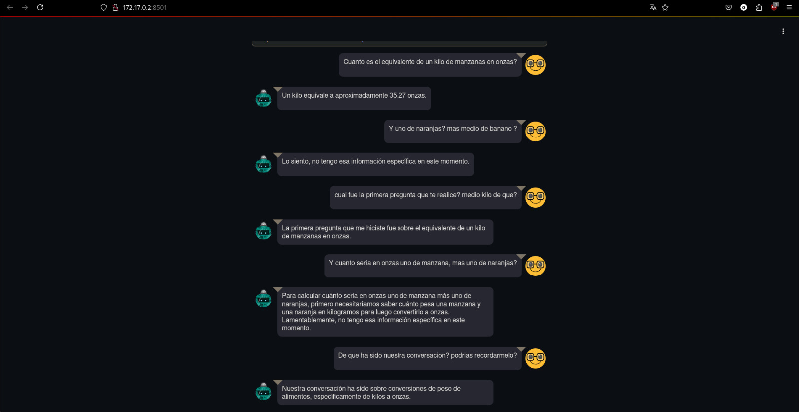

# Lab05 - Diseño e Innovación con IA
Gustavo Adolfo Cruz Bardales
No. 22779
---
## Dependencias 
Para ejecutar este laboratorio es necesario tener instalado:
- Docker
---
## ¿Cómo ejecutar el proyecto?
```sh
git clone https://github.com/G2309/IA-PROJECT-01.git
cd IA-PROJECT-01
docker buildx build -t llm-agent .
docker run --name Lab05-gustavo llm-agent:latest
```
---
## Assistant trabajando 

