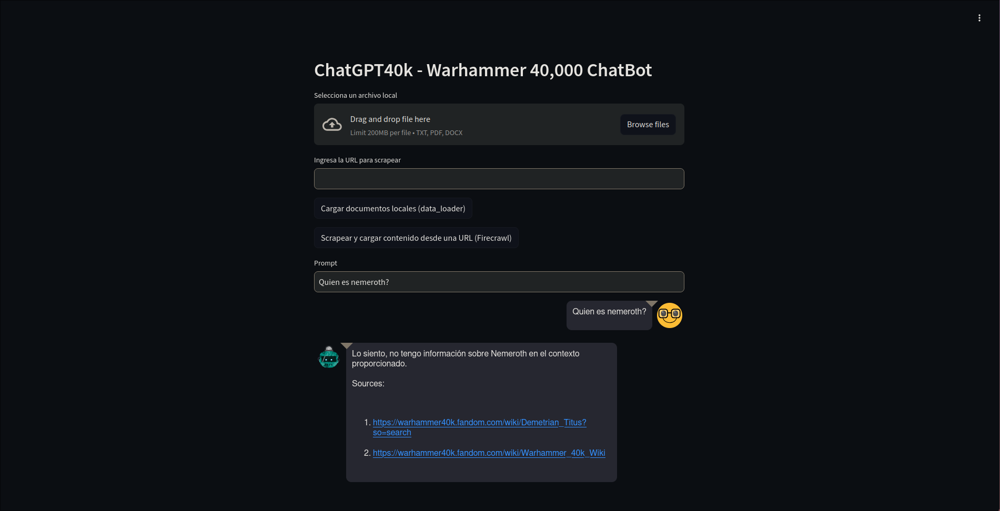
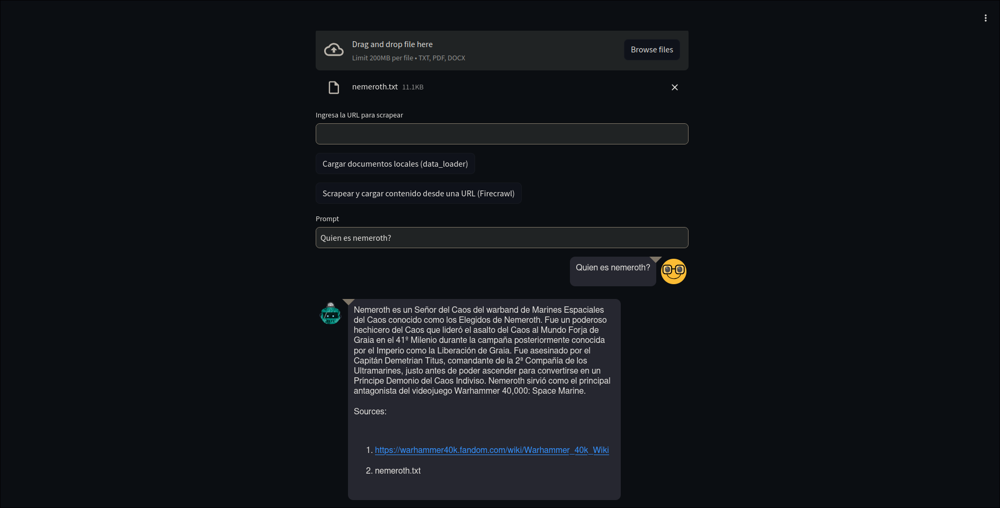

# Proyecto 01 - Diseño e Innovación con IA 💻🤖
**Autor:** Gustavo Adolfo Cruz Bardales  
**Carnet:** 22779  
---

## 🛠️ Dependencias
Para ejecutar este proyecto es necesario contar con las siguientes herramientas instaladas:
- [Docker](https://docs.docker.com/get-docker/)

También debes crear un archivo `.env` en el directorio raíz con las siguientes variables:

```sh
PINECONE_API_KEY=""
INDEX_NAME=""
OPENAI_API_KEY=""
PINECONE_ENVIRONMENT="" 
```
---
## 🚀 ¿Cómo ejecutar el proyecto?
```sh
git clone https://github.com/G2309/IA-PROJECT-01.git
cd IA-PROJECT-01
docker buildx build -t llm-agent .
docker run --name Proyecto01-gustavo llm-agent:latest
```
---
## 📂 Estructura del Proyecto
- main.py: Archivo principal que define la interfaz con Streamlit y conecta las funciones de carga de datos y consultas de IA.
- scrap/firecrawl.py: Lógica para obtener datos de una URL mediante scraping y cargarlos a Pinecone.
- data_loader.py: Función para procesar archivos locales y añadirlos a Pinecone.
- backend/cores.py: Módulo que gestiona las interacciones con el modelo LLM para generar respuestas basadas en los documentos cargados.
- Dockerfile: Define la configuración de Docker para crear una imagen que ejecuta la aplicación.
- .env: Archivo con las variables de entorno necesarias para conectar con las APIs de Pinecone y OpenAI. (No lo subí al repositorio)
---
## 📊 Evidencias del proyecto trabajando 
El agente llm al principio si se le hace una pregunta de un dato que no está en la base de datos de PineCone no contestará, como en el ejemplo antes de cargar informacion sobre `Nemeroth`.



Si se le carga un `.txt` con la informacion del personaje, ahora será capaz de responderlo al recargar la página.



Por último, adjunto un video del funcionamiento del proyecto.


